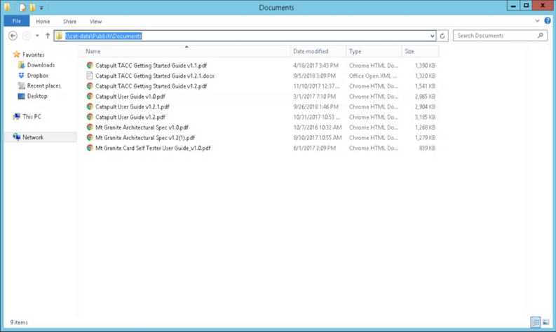
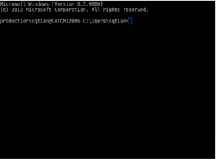
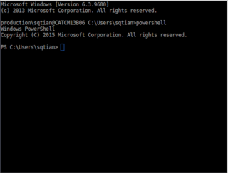
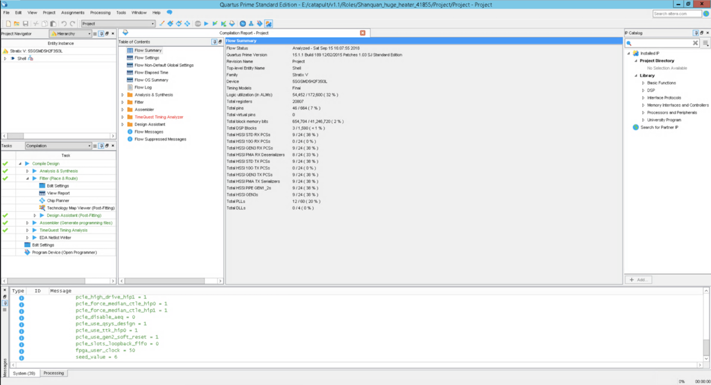
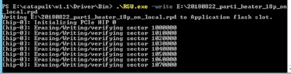
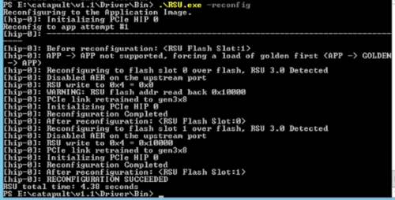

# Temporal Thermal Covert Channels in Cloud FPGAs
Authors: **[Shanquan Tian](https://caslab.csl.yale.edu/~shanquan/)**,  **[Jakub Szefer](https://caslab.csl.yale.edu/~jakub/)**

This folder contains the open-source code for the paper "[Temporal Thermal Covert Channels in Cloud FPGAs](https://doi.org/10.1145/3289602.3293920)". This code can be downloaded from [CASLAB code page](https://caslab.csl.yale.edu/code/temporalthermalcc/).

Prerequisites:

  - Access to [TACC Project Catapult](https://www.tacc.utexas.edu/systems/catapult)
  - A computer with an remote desktop client

## Getting Started

These instructions will get you a copy of the project up and running on your Catapult servers in TACC.

### TACC Account 

Before running the Covert Channel Experiment, please request an account to use [Project Catapult](https://www.tacc.utexas.edu/systems/catapult). Project Catapult is an open research system deployed at Texas Advanced Computing Center (TACC) in partnership with Microsoft Research.

### Remote Desktop Client

The default option to use Catapult servers in TACC is through remote desktop client. Based on the type of your computer, please install appropriate Remote Desktop Client. We recommend you to use Remmina on Linux.

### Software Versions
The versions of Catapult servers in TACC:

* OS: Window Server 2012
* Shell: v1.1
* SSH: OpenSSH-Win64 v7.7.2

### How to Use TACC Catapult Servers

A step by step series of examples that tell you how to get a development env running were explained by [Project Catapult Academic Program](https://www.microsoft.com/en-us/research/academic-program/project-catapult-academic-program/) and the tutorials on TACC servers after getting an account.
These tutorials can be found at ```\\cat-data\Publish\Documents``` on TACC Catapult servers. 




### Set Up SSH Service on TACC Catapult Servers

If you do not want to use the default remote desktop to access servers, you can set up SSH service (e.g. OpenSSH-Win64 v7.7.2) following instructions at [Install SSH](https://github.com/PowerShell/Win32-OpenSSH/wiki/Install-Win32-OpenSSH).
After successfully installing SSH on servers, Catapult servers can be accessed through SSH. The default shell is Windows Command Prompt, please turn to use Windows Powershell by executing command ```powershell```.



## 1. Running the Heater and Background Temperature Experiments
### Compiling the Project (option)
First, copy project and software to catapult folder.

* Copy the folder **heaterExperiment\Roles_heaterExperiment** to **your_path_to_catapult\catapult\v1.1\Roles**
* Copy the folder **heaterExperiment\Software_communication** to **your_path_to_catapult\catapult\v1.1\Software**



Follow the instructions from tutorials on servers to compile the project. A RPD file will be generated, here I give **heaterExperiment.rpd**.

### Running Heater or Background Temperature Experiments

Go the directory **your_path_to_catapult\catapult\v1.1\Driver\Bin**

```
.\RSU.exe -write path_to_rpd\heaterExperiment.rpd
.\RSU.exe -reconfig
```

 


Then go to directory **your_path_to_catapult\catapult\v1.1\Software\Software_communication\x64\Release**

For Heater Experiments, run
```
python heater_experiment.py
```
For Background Temperature Experiments, run
```
python server_temperature_pattern.py
```
Raw data will be collected.

## 2. Covert Channel Experiments

Minimum 8 Catapult servers are needed to run this experiment.

### Compiling the Project (option)

First, copy project and software to catapult folder.

* Copy the folder **covertChannelExperiment\Roles_PartOne_Heaters** to **your_path_to_catapult\catapult\v1.1\Roles**
* Copy the folder **covertChannelExperiment\Roles_PartTwo_Sensors** to **your_path_to_catapult\catapult\v1.1\Roles**
* Copy the folder **covertChannelExperiment\Software_communication** to **your_path_to_catapult\catapult\v1.1\Software**

Follow the instruction on [Project Catapult](https://www.microsoft.com/en-us/research/academic-program/project-catapult-academic-program/) to compile the project. 
After successful synthesis and generation process, two RPD files will be generated. In order to make life easier, here **part1_heater.rpd** and **part2_sensors.rpd** are given.

### Running Covert Channel Experiments

On server, please put RPD files and catapult folder in **E:\\**.

On your local machine, please execute

```
python covertChannel.py 01010101
```

The script will access the TACC servers through SSH and accomplish the reansmition of string 01010101 through Temporal Thermal Covert Channel.


## License


Please see LICENSE_INFORMATION.md file for license information.


## Acknowledgments

* Remy Scott
* Rob Moon 


